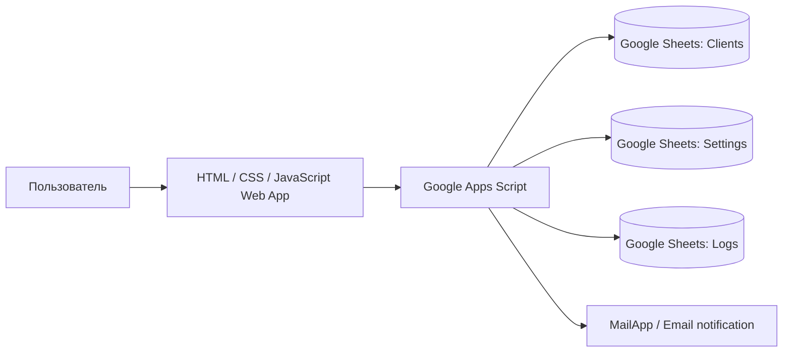

# MiniCRM — прототип CRM для юридической команды


**MiniCRM** — тестовое задание и рабочий MVP внутренней CRM для небольшой юридической команды.

Проект решает простую прикладную задачу: хранить клиентов, быстро менять статусы, видеть текущую загрузку и отправлять уведомление ответственному без отдельного сервера, хостинга и сложной инфраструктуры.

## Демо

- [Открыть Web App](https://script.google.com/macros/s/AKfycbwUqw1prf0ZuZY_IIe9JlHfudo_s9Y6qjgBvzGayZfD4Mz1Nl81G_DQUAQTL8Ilojv1Ug/exec)

Демо использует тестовые данные. Прямая ссылка на таблицу не публикуется как часть пользовательского сценария.

## Основной сценарий

1. Сотрудник открывает Web App.
2. Добавляет нового клиента и контактные данные.
3. Выбирает юридический статус и удобный способ связи.
4. Данные сохраняются в Google Sheets.
5. Ответственный получает email-уведомление.
6. Статус и комментарий можно обновлять из интерфейса.
7. Действия фиксируются в журнале.

## Что реализовано

- добавление клиента через Web App;
- хранение данных в Google Sheets;
- имя, телефоны, Telegram, email и удобный способ связи;
- юридические статусы под рабочий процесс команды;
- изменение статуса и комментария;
- список клиентов в интерфейсе;
- счётчики клиентов по статусам;
- автоматическое обновление данных из таблицы;
- отдельный лист `Settings` для настроек;
- отдельный лист `Logs` для журналирования;
- email-уведомление при добавлении клиента;
- фиксация результата отправки уведомления;
- нормализация данных перед отправкой во frontend.

## Архитектура



## Стек

| Область | Технологии |
|---|---|
| Хранилище | Google Sheets |
| Backend и Web App | Google Apps Script |
| Интерфейс | HTML, CSS, JavaScript |
| Уведомления | MailApp |
| Логирование | Google Sheets / Apps Script |

## Почему выбран этот стек

Для MVP за ограниченное время важнее было быстро получить рабочий результат, который легко проверить вручную.

Google Sheets выступает прозрачной базой данных, а Google Apps Script позволяет без отдельного сервера реализовать:

- backend-логику;
- Web App;
- работу с таблицей;
- email-уведомления;
- настройки и журнал действий.

## Что показывает проект как портфолио

Проект демонстрирует:

- перевод бизнес-сценария в работающий MVP;
- проектирование структуры данных и статусов;
- разработку простого внутреннего интерфейса;
- автоматизацию уведомлений;
- работу с валидацией, логированием и обработкой ошибок;
- выбор минимального стека под ограниченные сроки и бюджет.

## Моя зона ответственности

Я самостоятельно определил:

- пользовательский сценарий;
- структуру данных;
- набор юридических статусов;
- UX-логику;
- стек для быстрого MVP;
- требования к уведомлениям и логированию.

AI использовался как инструмент ускорения: для подготовки чернового кода, отладки Apps Script, проверки UX, обработки ошибок и оформления документации.

## Структура репозитория

```text
.
├── README.md
├── Code.gs
├── Index.html
├── appsscript.json
└── docs/
    └── TEST_LOG.md
```

## Развёртывание

1. Создать Google Sheets-файл.
2. Открыть `Extensions → Apps Script`.
3. Добавить содержимое `Code.gs`.
4. Создать HTML-файл `Index` и добавить содержимое `Index.html`.
5. Указать собственный `SPREADSHEET_ID`.
6. Запустить `setupPrototypeSheets`.
7. Запустить `debugBootstrapData` и проверить структуру данных.
8. Выполнить `Deploy → Manage deployments → New version → Deploy`.

## Безопасность

Перед использованием со своими данными необходимо:

- заменить тестовый `SPREADSHEET_ID` на собственный;
- ограничить права доступа к таблице;
- не публиковать реальные персональные данные клиентов;
- проверить email получателя в `Settings`;
- настроить доступ к Web App только для нужных пользователей;
- удалить тестовые записи перед рабочим запуском.

## Ограничения MVP

- нет полноценной авторизации внутри приложения;
- нет ролей и разграничения доступа;
- Google Sheets подходит для небольшого объёма данных, но не заменяет промышленную CRM;
- email является единственным каналом уведомлений;
- проект не предназначен для хранения реальных клиентских данных без дополнительной настройки безопасности.

## Возможные улучшения

- авторизация и роли;
- поиск и фильтры;
- Telegram-уведомления;
- задачи и напоминания;
- история изменения статусов;
- экспорт отчётов;
- перенос данных в отдельную базу при росте нагрузки.
